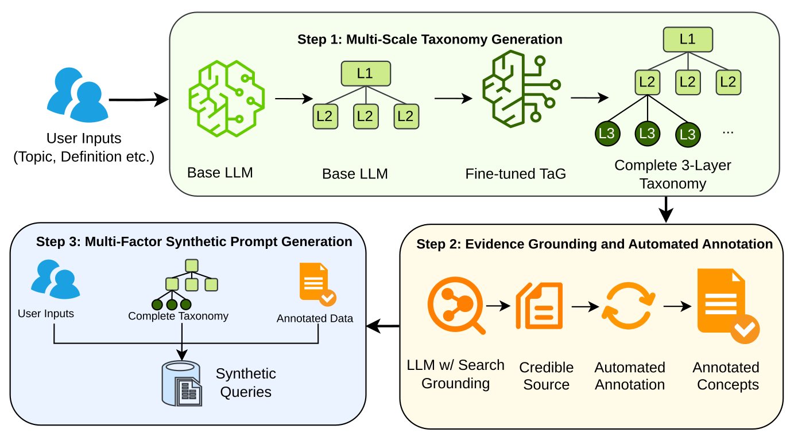

# NodeSynth: Socially Aligned Synthetic Data for AI Evaluation

🚀 [**Launch Live Prototype**](https://support-tickets-29m1bnjrfkk.streamlit.app/#end-to-end-workflow)

**NodeSynth** is a research prototype that implements a scalable, multi-stage methodology for creating socially relevant and evidence-grounded synthetic data (e.g., annotated queries) for AI model evaluation. 

The pipeline breaks down topics related to safety policies (e.g., harassment) and sensitive domains (e.g., education) into granular taxonomies using a fine-tuned taxonomy generator. It identifies key relationships within these taxonomies (e.g., affected social groups, geographic regions, use cases) and generates high-fidelity synthetic queries designed for rigorous model evaluation.

## 🚨 The Challenge
Standard benchmarks and manual query creation struggle to capture real-world sociotechnical nuance or scale effectively. While generic synthetic data offers an alternative, these datasets often contain unintended biases, lack diversity, and are inaccurate for highly-sensitive domains. NodeSynth enables users (researchers, developers, and auditors) to go from a high-level topic to a rich synthetic dataset capturing relationships that represent *documented harms* in the real world.

## 💡 Core Contributions
* **Sociotechnical Framework:** Leverages an expert-curated Taxonomy Generator (TaG) to ground abstract concepts in concrete, evidence-based scenarios.
* **Empowered Scaling:** Enables resource-constrained entities to conduct lightweight, scalable model evaluations specific to sensitive topics.
* **Interpretable Diagnostics:** Allows evaluators to trace exact failure intersections (demographics, geography, taxonomy level) to prioritize key areas of concern for targeted mitigation and in-depth human evaluation.

<p align="center">
  
  <br>
  <em><b>Figure 1:</b> A visual representation of the NodeSynth approach. Based on user inputs, NodeSynth (Step 1) creates a complete, three layer taxonomy using a fine-tuned model; and (Step 2) extracts metadata (e.g., sensitive characteristics) from relevant sources, related to the branches of the taxonomy. Utilizing the aforementioned concepts and annotations, NodeSynth (Step 3) generates annotated synthetic queries for model evaluation.</em>
</p>


## 🔄 End-to-End Workflow

You can explore the full workflow directly in our [**Live Prototype**](https://support-tickets-29m1bnjrfkk.streamlit.app/#end-to-end-workflow):

1. **Concept Setup:** Define the overarching theme (e.g., "Cultural Bias", "Medical Advice") and operational constraints (countries, languages, modality).
2. **Taxonomy Generation:** The system leverages a fine-tuned taxonomy generator (TaG) to intelligently extrapolate a structured vocabulary (L1, L2, L3).
3. **Data Synthesis:** Generate synthetic examples, anchoring them in intersections of sensitive attributes and complex societal contexts.
4. **Evaluation:** Define a rubric targeting nuanced harms. Evaluate the target model's performance on the synthetic dataset.
5. **Analysis Dashboard:** Perform root-cause analysis. Trace where model performance degrades across taxonomic and demographic intersections.

This prototype and the approach outlined in the [accompanying paper](https://arxiv.org/abs/2605.14381) can be used to conduct lightweight model evaluations specific to sensitive topics, enabling model developers and deployers to prioritize key areas of concern for in-depth human evaluation.

## ⚙️ Getting Started

TODO: Add installation and usage instructions.

## ⚙️ Requirements

TODO: List requirements and dependencies.

## 📖 Citation

If you use NodeSynth in your research, please cite the following paper:

```bibtex
@article{nodesynth2026,
  title={From Policy to Prompt: Socially Aligned Synthetic Data for AI Evaluation},
  author={TODO: Add full author list},
  year={2026}
}
```

## ⚠️ Disclaimer

This is not an officially supported Google product. This project is not
eligible for the [Google Open Source Software Vulnerability Rewards
Program](https://bughunters.google.com/open-source-security).

This project is intended for demonstration purposes only. It is not
intended for use in a production environment.

## ⚖️ License

This project is licensed under the Apache License 2.0 - see the [LICENSE](LICENSE) file for details.

## 🤝 Contributing

See [`CONTRIBUTING.md`](CONTRIBUTING.md) for details.

## How to run it on your own machine

python3 -m venv venv;
source venv/bin/activate;
pip install -r requirements.txt;
streamlit run streamlit_app.py;
